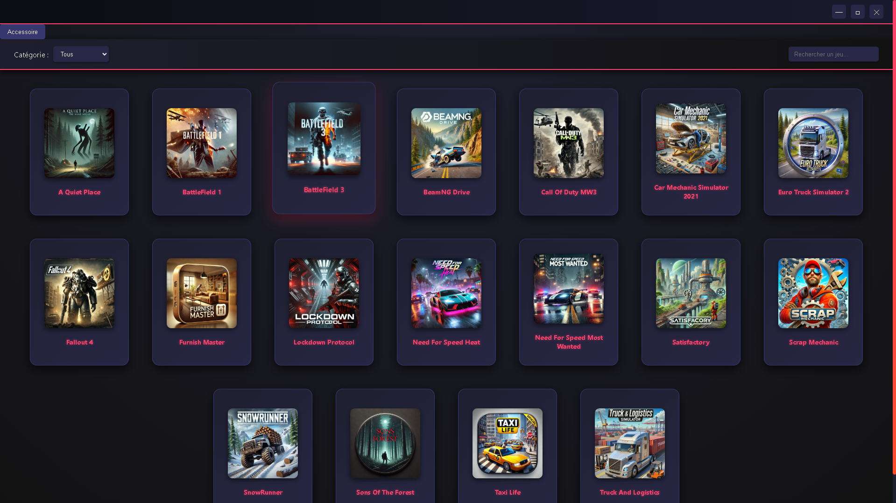

# 🎮 Game Center

**Game Center** est un launcher de jeux vidéo et d'accessoires développé avec **Electron.js**. Il permet de gérer et de lancer facilement vos jeux et applications depuis une interface moderne et intuitive.

---

## 📌 Sommaire
- [🚀 Fonctionnalités principales](#-fonctionnalités-principales)
- [🖼️ Captures d'écran](#-captures-décran)
- [🛠️ Installation](#-installation)
- [⚙️ Commandes utiles](#️-commandes-utiles)
- [📦 Générer un exécutable](#-générer-un-exécutable)
- [💻 Compatibilité](#-compatibilité)
- [🤝 Contribution](#-contribution)

---

## 🚀 Fonctionnalités principales

- 🎯 **Interface ergonomique et fluide** avec une grille de jeux dynamique.
- 🗂️ **Organisation intelligente** grâce à un système de catégories.
- 🔍 **Recherche instantanée** pour retrouver rapidement vos jeux.
- 🛠️ **Section Accessoires** pour lancer des outils comme **Auto Clicker** et **DS4Windows**.
- 🌙 **Thème sombre** avec des effets lumineux inspirés des launchers professionnels.
- 📐 **Mode plein écran** pour une immersion totale.

---

## 🖼️ Captures d'écran

### 🎮 Interface principale


### 🛠️ Section Accessoires


---

## 🛠️ Installation

### 1. **Cloner le projet**
```bash
git clone https://github.com/votre_nom_d_utilisateur/game-center.git
cd game-center

```

### 2. **Installer les dépendances**
```bash
npm install
```

##3. **Lancer l'application**
```bash
npm start
```